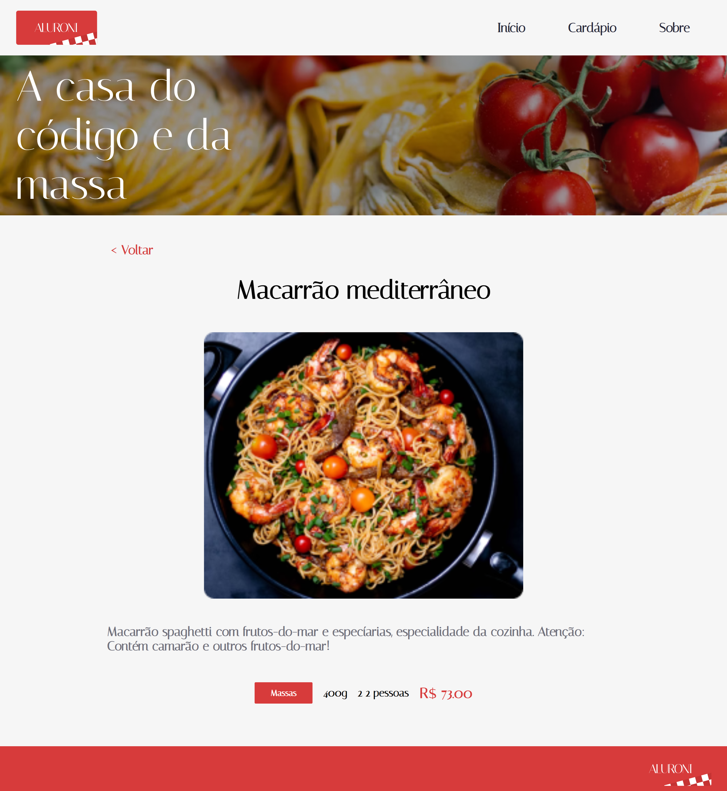
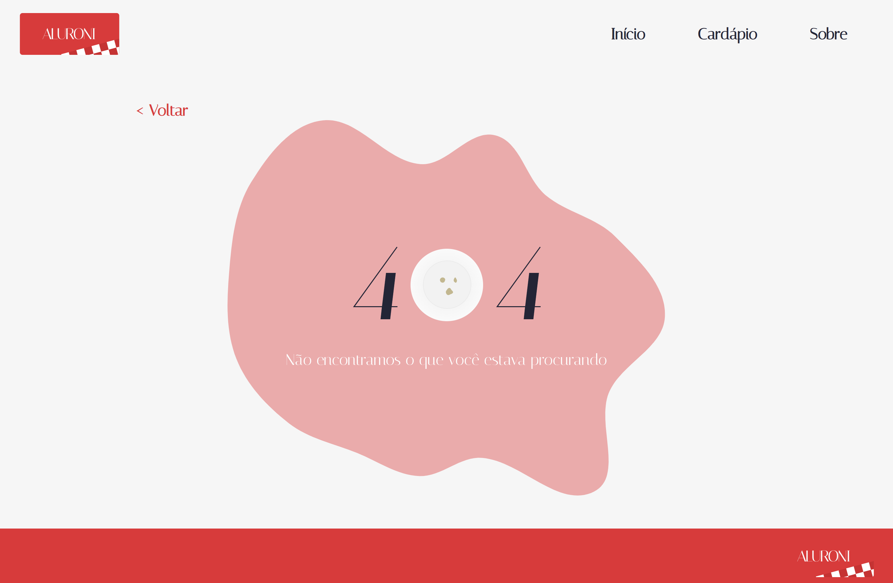

# Aluroni com React Router DOM

Esse aplicativo foi desenvolvido no curso <a href="https://cursos.alura.com.br/course/react-biblioteca-react-router/" target="_blank">React: Conhecendo a biblioteca React Router</a> , e teve como objetivo aprender criar páginas com SPA utilizando react-router-dom.

|Início|Cardápio|Prato|Sobre|404|
|------|--------|-----|-----|---|
||||||

## 🔨 Funcionalidades do projeto

Esse aplicativo é uma SPA de resta restaurante.

## ✔️ Técnicas e tecnologias utilizadas

Lista das bibliotecas utilizadas no desenvolvimento do Mapa:

- `react`
- `react-dom`
- `react-icons`
- `react-router-dom`
- `react-scripts`
- `typescript`

## 🛠️ Abrir e rodar o projeto

Para abrir e rodar o projeto, execute npm i ou yarn para instalar as dependências e npm start ou yarn start para inicar o projeto.

Depois, acesse <a href="http://localhost:3000/" target="_blank">http://localhost:3000/</a> no seu navegador. 

